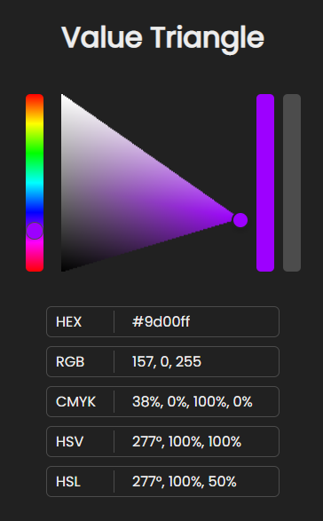

# Colour Value Triangle

Most colour triangle pickers are equilateral triangles. While this representation is more accurate in depecting the value relationships of colours compared to its square and circle counterparts, it does not account for the different values of different hues and saturations.

This project is largely inspired by Marco Bucci's video on [how value changes with hue and saturation](https://www.youtube.com/watch?v=gJ2HOj22gDo).

